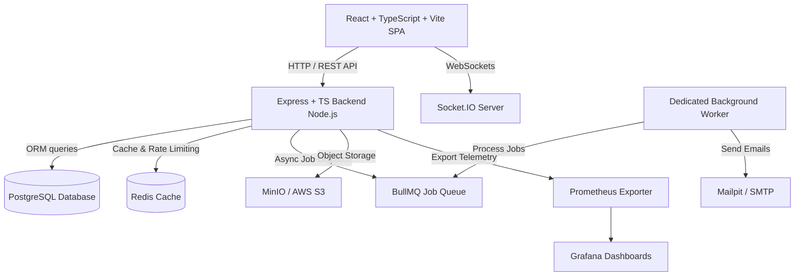

# HoyHel — Find Home Anywhere.

[](.github/workflows/ci.yml)
[](.github/workflows/security.yml)
[](LICENSE)

**HoyHel** (*Hoy* = Home, *Hel* = Find/Get — *Find Home Anywhere.*) is an enterprise-grade, highly scalable property rental and booking platform inspired by platforms like Airbnb, built with a modern brand identity, modular Node.js/TypeScript backend, Prisma ORM, PostgreSQL database design with serializable concurrency protection, Redis caching, BullMQ background queues, Socket.IO real-time communication, a luxury React + Vite SPA frontend, Kubernetes/Helm deployment packaging, Terraform AWS infrastructure, and comprehensive DevSecOps security pipelines.

---

## Architecture Diagram



---

## Key Platform Features

* **Advanced Search & Filtering**: Multi-attribute property search by city, country, guest capacity, price range, property types, amenities, ratings, and date-range availability checks.
* **Double-Booking Race Condition Protection**: PostgreSQL serializable transactions and row-level locks (`SELECT FOR UPDATE`) guaranteeing that zero double-bookings occur under concurrent traffic.
* **Server-Side Financial Engine**: Server-calculated itemized totals (`Nightly * Nights + Cleaning + Service Fee + Taxes - Discounts = Total`).
* **Pluggable Payment Abstraction**: Payment gateway layer supporting both Stripe card processing and an M-Pesa ready driver structure.
* **Configurable Cancellation Policies**: Automated refund calculation engine adhering to `FLEXIBLE`, `MODERATE`, and `STRICT` host policies.
* **Real-Time Guest ↔ Host Messaging**: Socket.IO powered property-linked chat threads, unread indicators, and online status.
* **Background Worker & Notifications**: Redis + BullMQ async job queues for transaction emails, unconfirmed booking auto-cancellation after 15 minutes, and audit logging.
* **System Audit Logging**: Comprehensive audit stream capturing user, action, resource ID, IP address, and request metadata for critical security events.
* **Role-Based Access Control (RBAC)**: Fine-grained permissions for `GUEST`, `HOST`, `ADMIN`, `PROPERTY_MANAGER`, and `SUPPORT_AGENT`.

---

## Tech Stack Overview

### Backend & Database
* **Runtime**: Node.js v20+, TypeScript, Express.js
* **Database & ORM**: PostgreSQL, Prisma ORM
* **Caching & Queues**: Redis, BullMQ
* **Real-time Engine**: Socket.IO
* **Authentication**: JWT (Access Token + Refresh Token rotation), HTTP-only cookies, Argon2/bcrypt
* **API Documentation**: OpenAPI 3.0 / Swagger UI (`/api/docs`)

### Frontend
* **Core**: React 18, TypeScript, Vite
* **Styling**: Tailwind CSS, Custom Glassmorphism design system
* **State Management**: TanStack Query v5, Zustand stores
* **API Communication**: Axios with auth header & token refresh interceptors

### DevOps, IaC & Observability
* **Containers**: Docker multi-stage builds, Docker Compose
* **Orchestration**: Kubernetes, Helm Charts (`helm/property-rental`)
* **Infrastructure as Code**: Terraform AWS modules (VPC, EKS, RDS PostgreSQL Multi-AZ, ElastiCache, S3, ALB)
* **DevSecOps Pipeline**: GitHub Actions CI/CD with Gitleaks (secrets), Semgrep (SAST), Trivy (container scan)
* **Observability**: Prometheus metrics exporter (`/metrics`), Grafana JSON dashboards

---

## Local Quickstart (Docker Compose)

1. **Clone & Configure Environment**:
   ```bash
   cp .env.example .env
   ```

2. **Launch All Services via Docker Compose**:
   ```bash
   docker compose up -d
   ```

3. **Service Endpoints**:
   * **Frontend SPA**: `http://localhost:80` (or `http://localhost:3000` in dev mode)
   * **Backend REST API**: `http://localhost:5000/api/v1`
   * **Swagger API Docs**: `http://localhost:5000/api/docs`
   * **Mailpit Web UI**: `http://localhost:8025`
   * **MinIO Object Console**: `http://localhost:9001` (Credentials: `minioadmin` / `minioadmin`)

---

## Database Migrations & Seeding

Run Prisma migrations and populate initial luxury seed data (Admin, Hosts, Guests, Amenities, Villas, Bookings, Reviews):

```bash
cd backend
npm run prisma:migrate
npm run prisma:seed
```

---

## Automated Testing Suite

Execute unit tests, financial pricing engine assertions, and concurrent double-booking race condition verification:

```bash
cd backend
npm test
```

---

## Kubernetes & Helm Deployment

Deploy to a Kubernetes cluster using the included Helm chart:

```bash
helm upgrade --install luxehaven ./helm/property-rental \
  --namespace luxehaven --create-namespace \
  -f ./helm/property-rental/values.yaml
```

---

## DevSecOps Pipeline

The repository features GitHub Actions security workflows:
* `.github/workflows/ci.yml`: Type checking, linting, unit & race condition tests.
* `.github/workflows/security.yml`: Gitleaks secret scan, Semgrep SAST code analysis, and Trivy container vulnerability scan.

---

## License

This project is licensed under the MIT License - see the [LICENSE](LICENSE) file for details.
